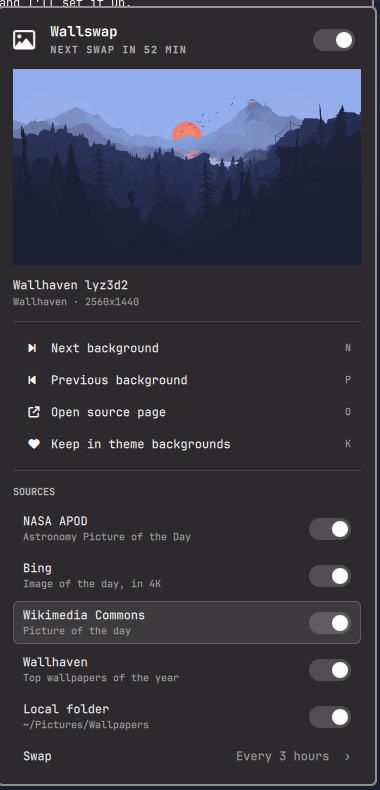

# Wallswap

An [Omarchy](https://omarchy.org) shell plugin that keeps your background fresh.
It picks up an image from one of a few good sources on a timer. It's the one
feature of Variety most people want, with none of the rest.

| Source | What you get |
|---|---|
| `apod` | NASA Astronomy Picture of the Day, random from the 30-year archive |
| `bing` | Bing image of the day (last ~2 weeks), in 4K |
| `wikimedia` | Wikimedia Commons picture of the day, random from the last 3 years |
| `wallhaven` | Top SFW wallpapers of the year on wallhaven.cc, optionally filtered by a search |
| `local` | A folder of your own images (default `~/Pictures/Wallpapers`) |

The first four sources are on by default, and the plugin swaps every 60 minutes. Images that are too small or
portrait are skipped, repeats are avoided, and when you are offline it
rotates through the ~40 images it has already cached.



## Install

```bash
omarchy plugin add https://github.com/petrzpav/omarchy-wallswap.git --enable
```

An icon appears in the right side of the bar. **Click** it for the panel:

- the current image with its title, credit and resolution (click it to open the source page)
- a switch to pause or resume automatic swapping, and when the next swap is due
- **Next** / **Previous** background
- **Open source page**
- **Keep in theme backgrounds**: copies the image to
  `~/.config/omarchy/backgrounds/<theme>/`, so it stays in the theme's own
  rotation (`omarchy theme bg next`)

The keyboard works too: arrows and Enter, or `N`, `P`, `O`, `K`, and `Space` to pause.
**Right-click** the icon for the next background, or **middle-click** to keep the current one.

## Settings

The panel's **Sources** section switches each source on or off and sets how
often to swap (click **Swap** to cycle through 15 min … once a day … only when you ask).

Everything else, and the same settings, live on the widget's entry in `~/.config/omarchy/shell.json`, which
reloads when you save it:

```json
{
  "id": "petrzpav.wallswap",
  "sources": ["apod", "bing", "wikimedia", "wallhaven", "local"],
  "interval": 30,
  "minWidth": 2560,
  "allowPortrait": false,
  "wallhavenQuery": "space",
  "localDir": "~/Pictures/Wallpapers",
  "nasaApiKey": ""
}
```

Or from the terminal:

```bash
omarchy bar set petrzpav.wallswap sources "apod bing"
omarchy bar set petrzpav.wallswap interval 30
omarchy bar set petrzpav.wallswap wallhavenQuery "mountains"
```

| Key | Default | Meaning |
|---|---|---|
| `sources` | apod, bing, wikimedia, wallhaven | where images come from; each swap picks one at random |
| `interval` | `60` | minutes between swaps; `0` = only when you ask |
| `minWidth` | `1920` | skip smaller images |
| `allowPortrait` | `false` | accept portrait images |
| `wallhavenQuery` | empty | Wallhaven search, e.g. `nature`, `space`, `city night` |
| `localDir` | `~/Pictures/Wallpapers` | folder for the `local` source |
| `nasaApiKey` | DEMO_KEY | free key from api.nasa.gov if you hit APOD's 50/day demo limit |

Changing the theme sets the theme's own background. Wallswap takes over again at
the next swap.

## Command line

The widget only drives `bin/wallswap`, which you can also use directly:

```bash
W=~/.config/omarchy/plugins/petrzpav.wallswap/bin/wallswap
$W next                         # new background now
$W prev                         # back to the previous one
$W pause | resume | toggle      # automatic swapping
$W next --sources apod          # ...from a specific source
$W info                         # current image as JSON
$W open | keep | sources | help
```

Open the panel from anywhere with `omarchy-shell wallswap toggle`.

Keybinding example (`~/.config/hypr/bindings.lua`):

```lua
o.bind("SUPER + ALT + B", "Next background", "~/.config/omarchy/plugins/petrzpav.wallswap/bin/wallswap next")
```

Files: images are cached in `~/.cache/wallswap/` and state is kept in `~/.local/state/wallswap/`.

Requires `curl`, `jq` and ImageMagick (all present on Omarchy).

## License

MIT
